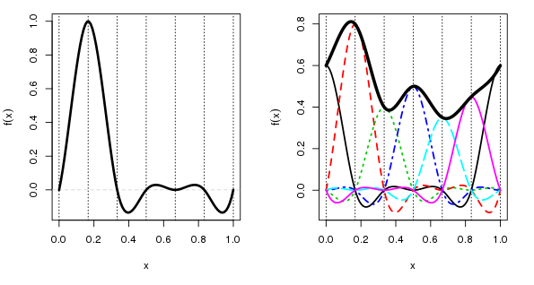
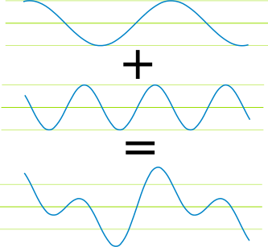

```{r setup, include=FALSE}
knitr::opts_chunk$set(echo = TRUE)
```

## What is this tutorial about?

This is a short lectorial on modelling time series data in R and serves as an introductory resource to help you to grapple time-series-specific data features such as seasonality, trend, and autocorrelation. This document is broken into a few key sections:

* Visualise the raw data
* Prepare the data for modelling
* Specify an initial model
* Plot the output
* Explore model performance
* Bonus: Specify a competing model

As for data, we are going to use the laboratory-confirmed influenza rate per 100,000 persons in Australia and try and forecast a synthetic counterfactual to compare the raw data against - the purpose of which is to ascertain the potential causal impact of COVID-19 restrictions on the influenza rate.

Let's get it!

## Visualise the raw data

The best first course of action when handling time series data is to prep it and plot it. Let's take a look.

```{r, warning = FALSE, message = FALSE, error = FALSE}
library(tidyverse)
library(readxl)
library(scales)
library(janitor)
library(forecast)
library(zoo)
library(lubridate)
library(mgcv)
library(data.table)

# Turn off scientific notation

options(scipen = 999)

# Useful cleaning function

cleaner <- function(filepath){
  
  d <- read_excel(filepath) %>%
    gather(key = month, value = value, 2:13)
  
  d1 <- d %>%
    mutate(the_date = paste0("01-",month,"-",year)) %>%
    mutate(the_date_format = as.Date(the_date, "%d-%b-%Y")) %>%
    mutate(indicator = case_when(
      year == 2020 & month == "Nov" ~ "Remove",
      year == 2020 & month == "Dec" ~ "Remove",
      TRUE                          ~ "Keep")) %>% # No data for these months which distorts ts modelling
    filter(indicator != "Remove") %>%
    dplyr::select(-c(indicator)) %>%
    mutate(value = log(value)) %>%
    mutate(value = case_when(
      value == -Inf ~ log(min(value)),
      TRUE          ~ value)) %>%
    dplyr::select(c(the_date_format, value))
  
  return(d1)
}

# Data load and high level prep

flu_gam <- cleaner("data/flu.xlsx") %>%
  rename(flu = value)

the_av_gam <- flu_gam %>%
  filter(the_date_format == as.Date("2002-04-01") | the_date_format == as.Date("2003-04-01")) %>%
  mutate(category = 1) %>%
  group_by(category) %>%
  summarise(av = mean(flu)) %>%
  ungroup()

the_val_gam <- as.vector(the_av_gam$av) 
```

```{r, message = FALSE, results = 'hide', fig.keep = 'all', warning = FALSE}
# Plotting code

ts_plot <- flu_gam %>%
  ggplot() +
  geom_line(aes(x = the_date_format, y = exp(flu)), colour = "#05445E", size = 1.25) +
  labs(title = "Raw time series data",
       x = "Date",
       y = "Influenza rate per 100,000 persons") +
  theme_bw() +
  theme(panel.grid.minor = element_blank())
print(ts_plot)
```

This is helpful and a few things stand out:

1. Volatility in the rate increases as a function of time
2. Mean influenza rate increases as a function of time

At this scale, fluctuations and other granular time-series features are hard to make out. Let's log scale the influenza rate and take another look.

```{r, message = FALSE, results = 'hide', fig.keep = 'all', warning = FALSE}
ts_plot_log <- flu_gam %>%
  ggplot() +
  geom_line(aes(x = the_date_format, y = flu), colour = "#05445E", size = 1.25) +
  labs(title = "Log-scaled time series data",
       x = "Date",
       y = "log(influenza rate)") +
  theme_bw() +
  theme(panel.grid.minor = element_blank())
print(ts_plot_log)
```

Now we can see what's going on! We seem to have regularly-spaced fluctuations that follow a relatively consistent pattern. This is known as. Evidently, the log scale lets us better visualise the nuances of high-variability data. For those unclear as to why this works, taking the log of a variable essentially penalises high values. The added bonus in our case, since the influenza rate can't be negative, is that taking the logarithm forces model outputs to be positive. We can then back-transform our model predictions to the original scale by exponentiating the log values with a trivial calculation. Swell!

## Prepare the data for modelling

Before we model the data we have to prep it in the correct form. For this first model, we are going to use a [generalised additive model](https://en.wikipedia.org/wiki/Generalized_additive_model). This requires us to make numeric values for year and month separately as opposed to feeding a date object directly.

```{r, message = FALSE, warning = FALSE}

# Create numeric values for months and years to feed into GAM model

gam_dat <- flu_gam %>%
  mutate(flu = case_when(
    the_date_format == as.Date("2001-04-01") ~ the_val_gam,
    TRUE                                     ~ flu)) %>% 
  mutate(nyear = gsub("-.*", "\\1", the_date_format),
         nmonth = gsub('.{3}$', '', the_date_format),
         nmonth = gsub('^.{5}', '', nmonth),
         nyear = as.numeric(nyear),
         nmonth = as.numeric(nmonth))

# Remove post-intervention period data

months <- c(5,6,7,8,9,10)

truncated <- gam_dat %>%
  mutate(indicator = case_when(
         nyear == 2020 & nmonth %in% months ~ "Remove",
         TRUE                               ~ "Keep")) %>% 
  filter(indicator == "Keep")
```

## Specify an initial model

Now that our data is ready, we can specify the GAM model. Using the *mgcv* package, this is a trivial amount of code.

```{r, message = FALSE, warning = FALSE}
m1 <- gam(flu ~ s(nmonth, k = 12, bs = "cc") + s(nyear, k = 18),
          data = truncated,
          method = "REML")
```

### Features of a time series GAM

The crucial parts of a GAM are the number and types of basis function used. For the trend component this was simple - we just fit a separate line for each year and all get added together at the end. For the seasonality component what we did was a bit more complex. We specified 12 knots (one for each month in the year) and a "cc" basis function. This is a cyclic cubic function which looks like the image below not the one used in our model - just an illustration). For time series seasonality, this decision is crucial, as a cyclic cubic function connects the start and the end of the function - meaning the seasonality term will have continuity across years. Very nice.



### Use the model to forecast

So far we have trained our model on the historical data. We can now use it for forecasting. Let's prepare new data for the forecasting (we only need the predictor variable values). We can then compute confidence intervals around our forecasts and wrap it all up in a single dataframe for plotting and other use.

```{r, message = FALSE, warning = FALSE}
# Make some new data that is the post-intervention period of 2020

newdat <- data.frame(nyear = c(2020,2020,2020,2020,2020,2020,2020,2020),
                     nmonth = c(5,6,7,8,9,10,11,12))

# Predict counts based on model-smoothed seasonality and trend
# and account for link function inverse

ilink <- family(m1)$linkinv

# Compute confidence intervals

newd <- cbind(newdat, as.data.frame(predict(m1, newdat, type = "link", se.fit = TRUE)))
newd <- transform(newd, fitted = ilink(fit), upper = ilink(fit + (2 * se.fit)),
                  lower = ilink(fit - (2 * se.fit)))

# Pull all forecast outputs into a single dataframe

preds <- newd %>%
  mutate(nmonth_adj = case_when(
    nmonth < 10 ~ paste0("0",nmonth),
    TRUE        ~ as.character(nmonth))) %>% 
  mutate(date = paste0(nyear,"-",nmonth_adj,"-01")) %>% 
  mutate(date = as.Date(date, format = "%Y-%m-%d"))
```

## Plot the output

With the counterfactual forecast model fully done, we can now plot the output to visualise our work. Evidently, there is a very large discrepancy between what we might expect the influenza rate in 2020 to have been in the absence of COVID-19 restrictions, social distancing, and hygiene behaviour change.

```{r, echo = FALSE, message = FALSE, fig.keep = 'all', warning = FALSE}
p <- gam_dat %>%
  ggplot() +
  geom_ribbon(data = preds, aes(x = date, ymin = lower, ymax = upper), fill = "steelblue2", alpha = 0.4) +
  geom_line(data = preds, aes(x = date, y = fitted), colour = "steelblue2", size = 1, linetype = "dashed") +
  geom_line(aes(x = the_date_format, y = flu), colour = "#05445E", size = 1.25) +
  labs(title = "Forecasted counterfactual influenza rate vs actual rate on log scale",
       subtitle = paste0("Dark blue line indicates actual data. Light blue indicates modelled counterfactual forecast.\n",
                         "Assumes COVID-19 impacts are evident from April 2020."),
       x = "Date",
       y = "log(influenza rate)") +
  theme_bw() +
  theme(panel.grid.minor = element_blank())
print(p)
```

And for good measure, let's exponentiate the values to put it back on the original scale.

```{r, echo = FALSE, message = FALSE, fig.keep = 'all', warning = FALSE}
p1 <- gam_dat %>%
  ggplot() +
  geom_ribbon(data = preds, aes(x = date, ymin = exp(lower), ymax = exp(upper)), fill = "steelblue2", alpha = 0.4) +
  geom_line(data = preds, aes(x = date, y = exp(fitted)), colour = "steelblue2", size = 1, linetype = "dashed") +
  geom_line(aes(x = the_date_format, y = exp(flu)), colour = "#05445E", size = 1.25) +
  labs(title = "Forecasted counterfactual influenza rate vs actual rate on original scale",
       subtitle = paste0("Dark blue line indicates actual data. Light blue indicates modelled counterfactual forecast.\n",
                         "Assumes COVID-19 impacts are evident from April 2020."),
       x = "Date",
       y = "Influenza rate per 100,000 persons") +
  theme_bw() +
  theme(panel.grid.minor = element_blank())
print(p1)
```

## Explore model performance

We can extract statistical outputs and model fit statistics the same way we do with basic linear regression and other models in R.

```{r, warning = FALSE}
summary(m1)
```

### Extracting model values

We can extract values of interest from this summary easily. Let's extract the model deviance explained statistic (akin to R-squared in standard linear regression). This is a pretty strong result for a model that only accounts for between-year variance (i.e. trend) and within-year variance (i.e. monthly seasonality) and no other factors.

```{r, warning = FALSE}
the_text <- paste0("Model deviance explained = ", round(summary(m1)$dev.expl*100, digits = 2), "%")
the_text
```

## Bonus: Specify a competing model

GAMs are just one of many tools at the analyst's disposal when modelling time series data. A more common tool used by econometricians is an ARIMA (autoregressive integrated moving average). ARIMA models are not well-equipped to handle non-stationary data (i.e. not white noise - has trend and seasonality). However, there are some simple workarounds for this in R, such as using a [Fourier series](https://en.wikipedia.org/wiki/Fourier_series) to model seasonality and adding it in as an exogenous regressor. A Fourier series can look something like this.



### Prep the data

Since an ARIMA model requires data in the form of a time-series object, we need to do some preprocessing in addition to instantiating the Fourier series seasonality vector. The important parameter for simulating a Fourier series is *K* which is the order, or, the number of terms (must be <= period/2). An appropriate value for K can be chosen through minimising a fit index that penalises model complexity, such as the Akaike information criterion (AIC). We can do this using a loop over a set of reasonable values. Fitting the actual an ARIMA in R is a very minimal task in terms of code.

```{r, message = FALSE, warning = FALSE}

# Make a time-series object of the flu data

arima_data <- ts(truncated$flu, start = as.Date("2001-01-01"), frequency = 12)

# Optimise K

k_to_try <- c(1,2,3,4,5,6)
model_store <- list()

for(k in k_to_try){
  # Fourier series for seasonality
  
  z <- fourier(ts(arima_data, frequency = 12), K = k) # base model
  
  tmp_mod <- auto.arima(arima_data, xreg = z, seasonal = FALSE)
  
  tmp1 <- data.frame(k = c(k),
                     aic = c(tmp_mod$aic))
  model_store[[k]] <- tmp1
}

k_outputs <- rbindlist(model_store, use.names = TRUE) %>%
  slice(which.min(aic))

optimal_k <- k_outputs$k # K value corresponding to lowest AIC model

# Pass optimal k into final model and run

z <- fourier(ts(arima_data, frequency = 12), K = optimal_k) # base model
fit <- auto.arima(arima_data, xreg = z, seasonal = FALSE)

# Forecast Fourier series

zf <- fourier(ts(arima_data, frequency = 12), K = optimal_k, h = 8) # forecast model

```

### Forecasting

We can easily pass the model to the forecast function to produce our estimates.

```{r, message = FALSE, warning = FALSE}
fc <- forecast(fit, xreg = zf, h = 8)
```

### Plot the output

```{r, message = FALSE, fig.keep = 'all', warning = FALSE}
# Retrieve model estimates in a dataframe

arima_forecasts <- data.frame(coeff = fc$mean,
                              lower = fc$lower,
                              upper = fc$upper)

# Dates to enable plotting

fc_dates <- data.frame(date = c("2020-05-01", "2020-06-01", "2020-07-01", "2020-08-01", 
                                "2020-09-01", "2020-10-01", "2020-11-01", "2020-12-01"))

arima_forecasts <- cbind(arima_forecasts, fc_dates) %>%
  mutate(date = as.Date(date))

# Plot

p_arima <- gam_dat %>%
  ggplot() +
  geom_ribbon(data = arima_forecasts, aes(x = date, ymin = lower.80., ymax = upper.80.), fill = "steelblue2", alpha = 0.4) +
  geom_line(data = arima_forecasts, aes(x = date, y = coeff), colour = "steelblue2", size = 1, linetype = "dashed") +
  geom_line(aes(x = the_date_format, y = flu), colour = "#05445E", size = 1.25) +
  labs(title = "ARIMA forecast on log scale",
       x = "Date",
       y = "log(influenza rate)") +
  theme_bw() +
  theme(panel.grid.minor = element_blank())
print(p_arima)
```

We can then compare the performance of our GAM and ARIMA models through a few key metrics:

* Some form of squared error against known data (e.g. mean square error, root mean square error)
* Akaike information criteria (AIC; a model fit statistic that penalises complex models)

## Further information

If you have any questions, please shoot me an email at trent.henderson@nousgroup.com.au - I'm always happy to help :)
